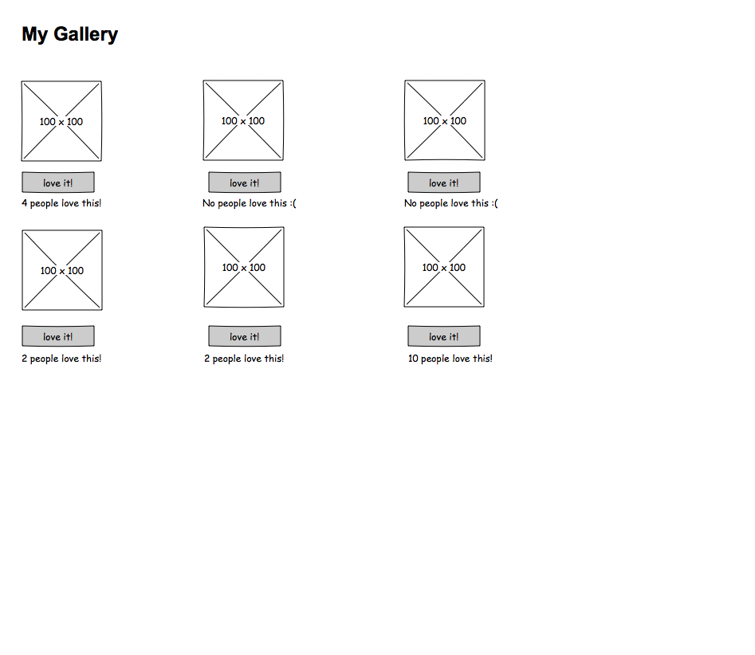

# Significant-Pics

### Directions from the client

This weekend's application will be a gallery of 6 or more pictures of significance to you. When someone clicks on a picture, they should see a brief synopsis of why you chose to display that photo. Users can also heart/thumbs up/favorite your photo as many times as they want; you'll need to keep track of how many times it was clicked.

### Task list for Significant-Pics

- [ ] Setup folders, file locations, and server.js with pathing to index.html.
- [ ] Setup folders, file locations, and server.js with pathing to index.html.
- [ ] Setup folders, file locations, and server.js with pathing to index.html.
- [ ] Setup folders, file locations, and server.js with pathing to index.html.
- [ ] Setup folders, file locations, and server.js with pathing to index.html.
- [ ] Setup folders, file locations, and server.js with pathing to index.html.
- [ ] Setup folders, file locations, and server.js with pathing to index.html.
- [ ] Setup folders, file locations, and server.js with pathing to index.html.
