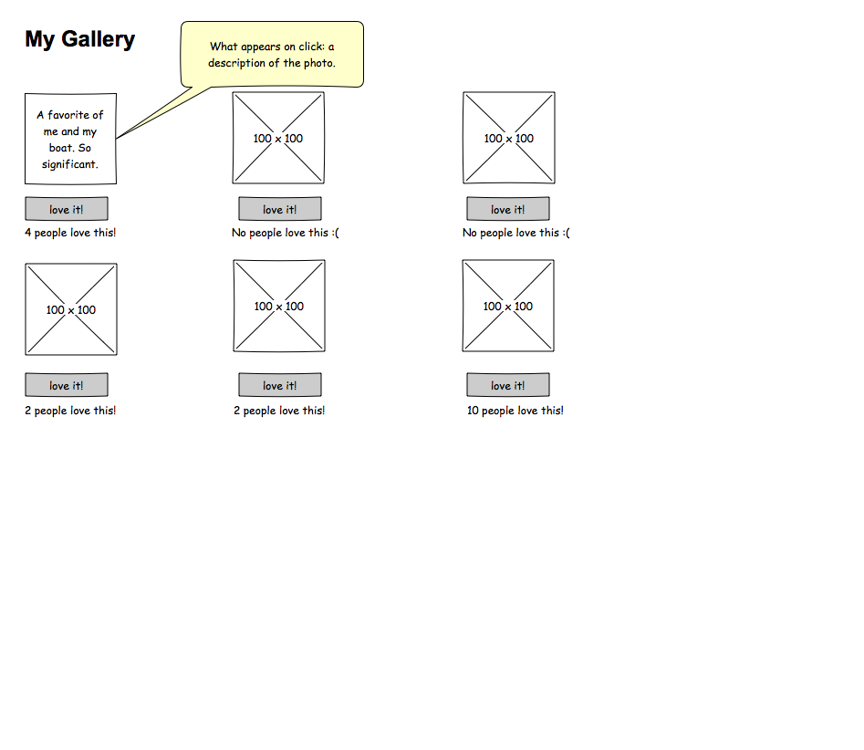

# Significant-Pics

### Directions from the client

Create a gallery of 6 or more pictures of significance to you. When someone clicks on a picture, they should see a brief synopsis of why you chose to display that photo. Users can also heart/thumbs up/favorite your photo as many times as they want; you'll need to keep track of how many times it was clicked.

## Image of page on load

## Image of page on picture click by user

## Task list for Significant-Pics

- [x] Setup folders, file locations, and server.js with pathing to index.html.
- [x] Find 6 images with significance to me.
- [x] Add images to a js array.
- [x] Use an ng-repeater to add them to the DOM with text and buttons.
- [x] Add button function which increments likes by 1 on click.
- [x] Complete setup of click which displays text describing significance.
- [x] Add bootstrap styling.
- [ ]
- [ ]
